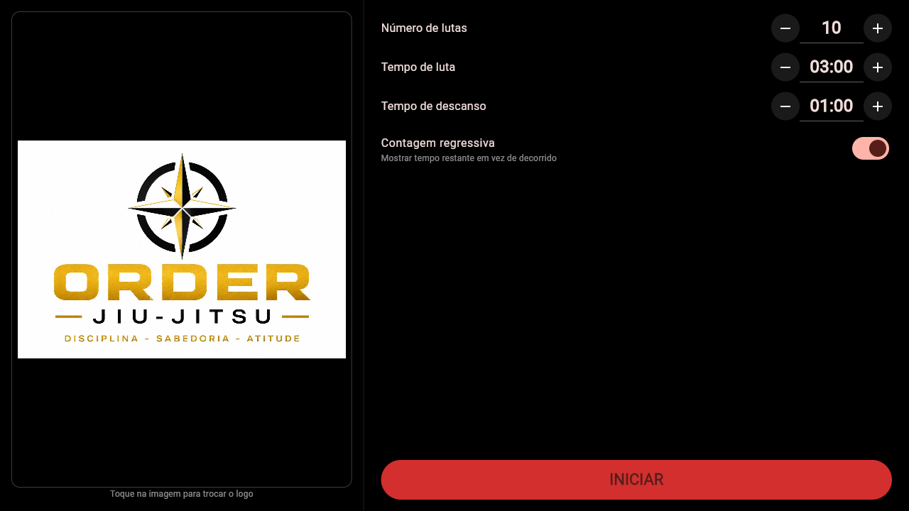

# ⏱️ Fight Timer 🥊

**Timer de rounds profissional para academias de artes marciais** — construído com Flutter.


> Jiu-Jitsu, Muay Thai, Boxe, MMA — configure os rounds, aperte INICIAR e deixe o gongo comandar o treino.



## ✨ Funcionalidades

- 🥋 **Rounds configuráveis** — defina quantas lutas, tempo de luta e tempo de descanso
- ⌨️ **Entrada rápida** — digite os valores diretamente ou ajuste com − / +
- 🔔 **Sons de treino reais** — sino de luta na largada, alerta de encerramento no fim e bips de contagem nos últimos 3 segundos do round
- 🖼️ **Logo personalizada** — a marca da sua academia em destaque no telão, escolhida direto da galeria
- 📺 **Feito para o telão da academia** — modo paisagem, dígitos gigantes visíveis do outro lado do tatame e tela sempre ligada durante o treino
- ⏸️ **Pausa com um toque** — qualquer toque na tela pausa e retoma o cronômetro
- ⏳ **Contagem regressiva ou progressiva** — você escolhe como acompanhar o tempo
- 💾 **Configuração persistente** — o app lembra tudo entre os treinos

## 🖥️ A tela do treino

```
┌─────────────────────────────────┐
│        LOGO DA ACADEMIA         │
│                                 │
│           LUTA 3/10             │
│                                 │
│            01:42                │
│                                 │
│         Faltam 7 lutas          │
└─────────────────────────────────┘
```

Vermelho durante a luta, âmbar no descanso, verde ao concluir — o professor sabe a fase do treino de qualquer lugar da academia.

## 🚀 Como executar

Pré-requisito: [Flutter SDK](https://docs.flutter.dev/get-started/install) instalado.

```bash
git clone https://github.com/clever-ro-oliveira/fight-timer.git
cd fight-timer
flutter pub get

# Rodar no navegador
flutter run -d chrome

# Rodar no celular conectado via USB
flutter run

# Gerar o APK de instalação
flutter build apk --release
# → build/app/outputs/flutter-apk/app-release.apk
```

## 🏗️ Estrutura do projeto

```
lib/
  main.dart            # ponto de entrada — tema escuro, trava em paisagem
  settings.dart        # modelo de configurações + persistência
  config_screen.dart   # tela de configuração do treino
  timer_screen.dart    # timer com fases luta/descanso, sons e wakelock
assets/
  sounds/              # sino de luta, encerramento e bips
  images/              # logo padrão
```

**Pacotes utilizados:** [`audioplayers`](https://pub.dev/packages/audioplayers) · [`wakelock_plus`](https://pub.dev/packages/wakelock_plus) · [`image_picker`](https://pub.dev/packages/image_picker) · [`shared_preferences`](https://pub.dev/packages/shared_preferences)

## 💡 Por que este projeto?

Sou desenvolvedor PHP e este é o meu **primeiro aplicativo mobile**. Nasceu de uma necessidade real: um timer de rounds simples e confiável para o telão da academia de Jiu-Jitsu, sem anúncios e com a identidade da equipe.

Foi também o meu laboratório para aprender na prática:

- A arquitetura de **widgets** e o gerenciamento de estado do Flutter
- Programação **assíncrona em Dart** (`async/await`, timers, streams de áudio)
- Build e distribuição Android via **APK** (sideload, sem Play Store)
- Um único código rodando em **Android e Web**

## 📄 Licença

Distribuído sob a licença [MIT](LICENSE).

---

Feito com 🥋 e Flutter por [Cleverson Oliveira](https://github.com/clever-ro-oliveira)
